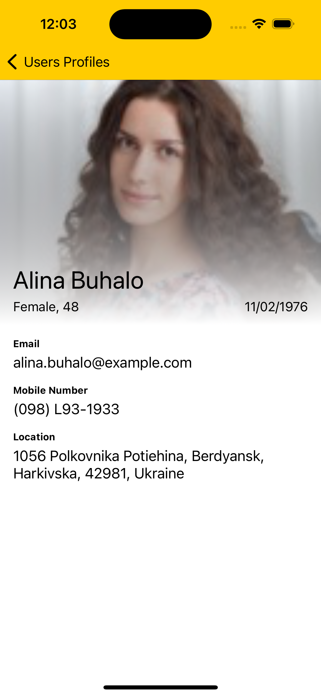

# Ramdom Profiles iOS App

This is a sample iOS app which I made to learn iOS development. This app contains some cool  features like:
- Infinite Scolling
- Profile Search

This respo app tells how to use the TableView in Swift to build vertical listviews and infinite scrolling feature, with an actual API.

**API's Used:** The user profiles data has been taken from [Random User API](https://randomuser.me/) 

| Home Screen | Scroll Screen| Search Screen | Profile Screen | 
|-----|----|----|----|
|||||